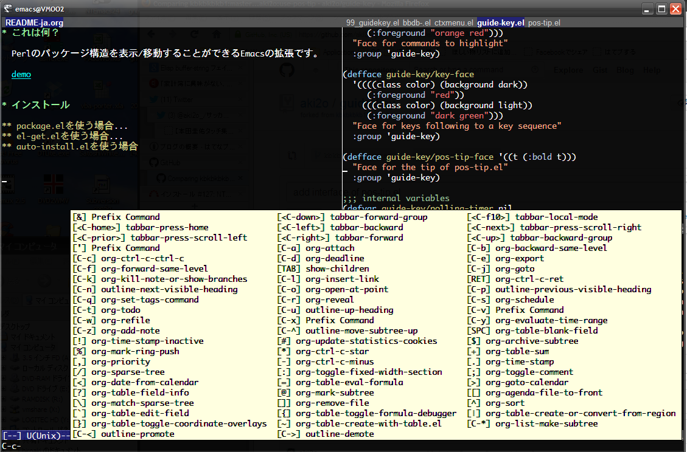
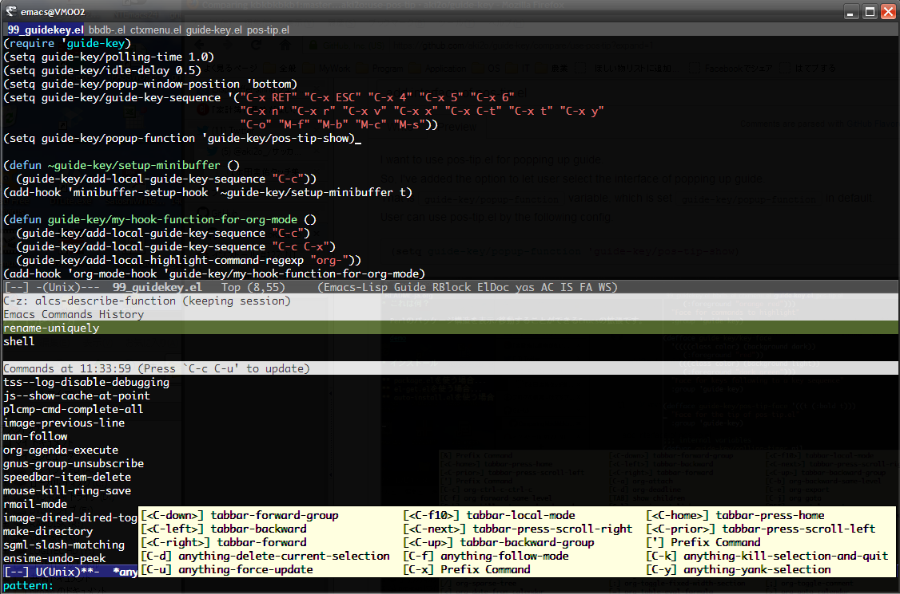

# What's this?

This is a extension of Emacs that provides a interface of  using pos-tip.el.  

# Feature

### Guide key using pos-tip.el



### Guide key in the function of anything.el/helm.el


-   guide-key.el can not work in mini-buffer

# Install

### If use package.el

2014/04/07 It's available by using melpa.

### If use el-get.el

2014/04/07 It's available. But, master branch only.

### If use auto-install.el

```lisp
(auto-install-from-url "https://raw.github.com/aki2o/guide-key-tip/master/guide-key-tip.el")
```
-   In this case, you need to install each of the following dependency.

### Manually

Download guide-key-tip.el and put it on your load-path.  
-   In this case, you need to install each of the following dependency.

### Dependency

-   
-   pos-tip.el

# Configuration

```lisp
(require 'guide-key-tip)
(setq guide-key-tip/enabled t)
```

# Usage

-   You can switch to enable/disable this function by M-x `guide-key-tip/toggle-enable`

# Tested On

-   Emacs &#x2026; GNU Emacs 24.3.1 (i686-pc-linux-gnu, GTK+ Version 3.4.2) of 2014-02-22 on chindi10, modified by Debian
-   guide-key.el &#x2026; 1.2.3
-   pos-tip.el &#x2026; 0.4.5

**Enjoy!!!**
